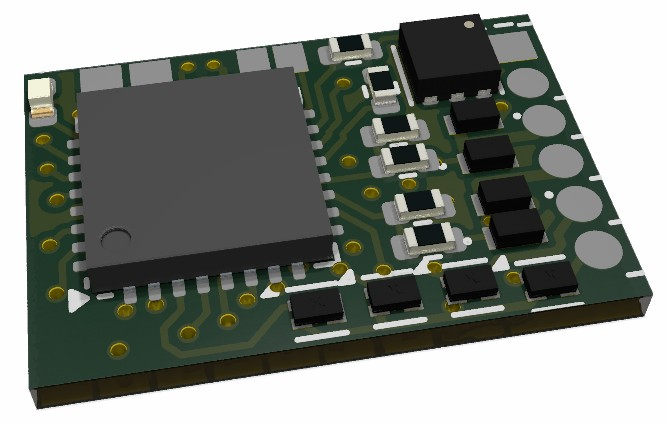
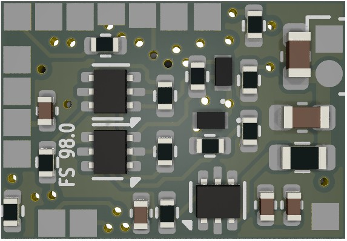
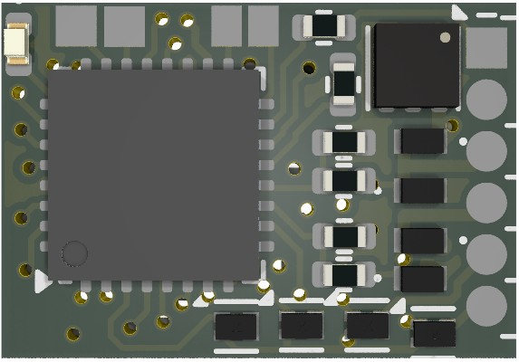
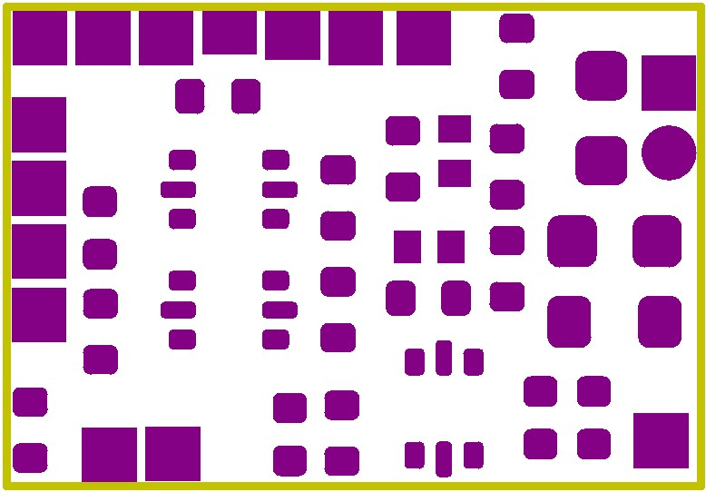
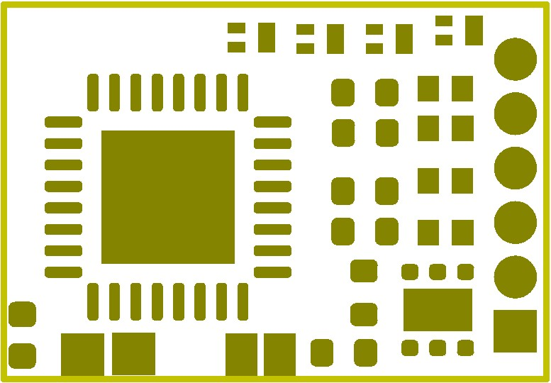

# RTB_D98

## This is a [OpenDcc](https://forum.opendcc.de/viewtopic.php?t=11034) forum project
The hard and software is based on the [D16](https://rtb4dcc.de/hardware/decoder/d16/) motor decoder. It implements a double-sided NEM-651 **function decoder** for use with DCC infrastructure. The hardware provides
- 10 auxiliary output ports
- single WS28xx connector (controlling up to 32 external neo pixels).

``Note: this repo is currently under construction and will be completed soon. (Feb 20, 2026)``

See also

- [RTB_D16 - NEM651](/../../../../git4dcc/RTB_D16)

User Guides

- User Guide - DE
- User Guide - EN

 

The decoder has the following features,
- **NEM-651** connector
- **DCC**
  - DCC-A automatic logon
  - DCC-R protocol extension
  - Service Mode Programming
- **Railcom**
  - Channel 1/2
  - POM, xPOM, Long_1
  - DYN: QoS, Track-voltage, AUX-current, Temp, East/West
- double sided
- Dimension: 13 x 9 mm
- 7-20V track voltage
- heartbeat LED
- adjustable max AUX current (default 500mA)
- over temp protection
- Function output: LV/LR/AUX1/AUX2 open drain
- Function output: AUX3/AUX4/AUX5/AUX6/AUX7/AUX8 logic level (3.3V)
- Function output: LV/LR/AUX1/AUX2/AUX3/AUX4 (dimmable, 1.4kHz)
- WS28xx output: controls up to 32 WS28xx neo pixels
- optional external buffer capacitor (max. 1500uF)
- <10mA idle power consumption
- Firmware update over main tracks via DCC-R protocol

# Hardware
The current PCB layout uses SMD footprints with 0.5mm pitch and mainly 0402 parts. Reflow soldering is recommended, handsoldering nearly impossible.

   

## PCB
- 6-layer PCB, FR4, 13 x 9 x 0.8mm (double sided)
- CPU: AVR64DA32
- Connector: NEM-651 (or solder)

## Kicad
[Schematic](doc/D98_schematic.pdf) | [Layout](doc/D98_layout.pdf) | [Gerber](gerber)

Dependency

 

:yellow_circle: Requires my Kicad project library [RTB_SamacSys](https://github.com/git4dcc/RTB_SamacSys) in the same directory tree.

## Firmware
Filename structure: { **pcb** }{ **code** }{ **version** }.hex

Example: **D98F0001**.hex

|   | Description |
| --- | --- |
| **pcb** | Name of matching hardware (**D98**) |
| **code** | Type of code contained (**R**=rom, **B**=bootloader, **F**=flash, **U**=bld update, **P**=UPDI factory code) |
| **version** | Release version (**####**) |

[Firmware files](firmware)

# Images
| top | bottom |
| --- | --- |
|  |  |

# YouTube
Some YouTubes to see the D98 decoder in action.  

This project is intended for hobby use only and is distributed in accordance with the Apache License 2.0 agreement.
